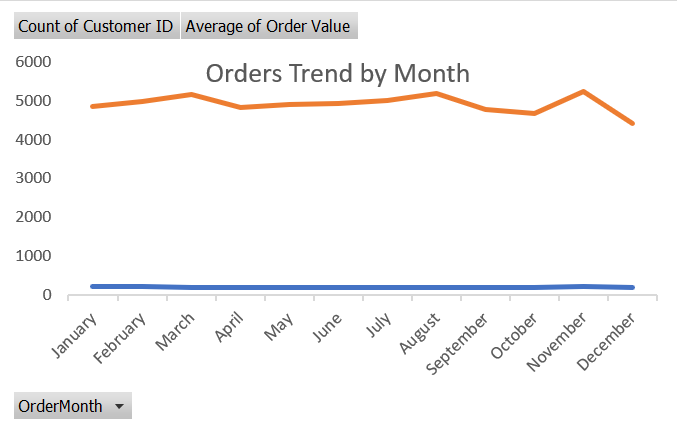
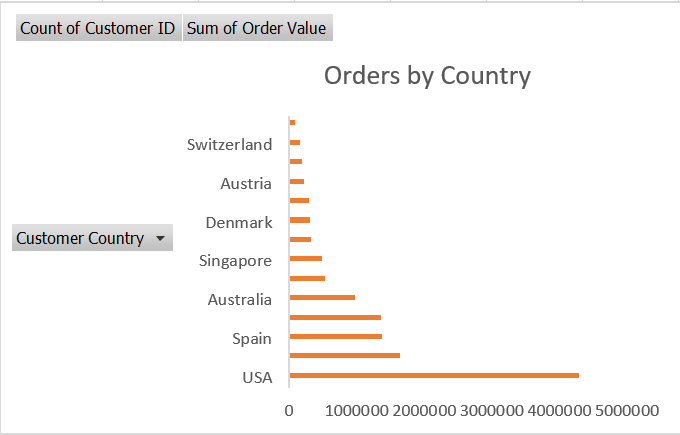
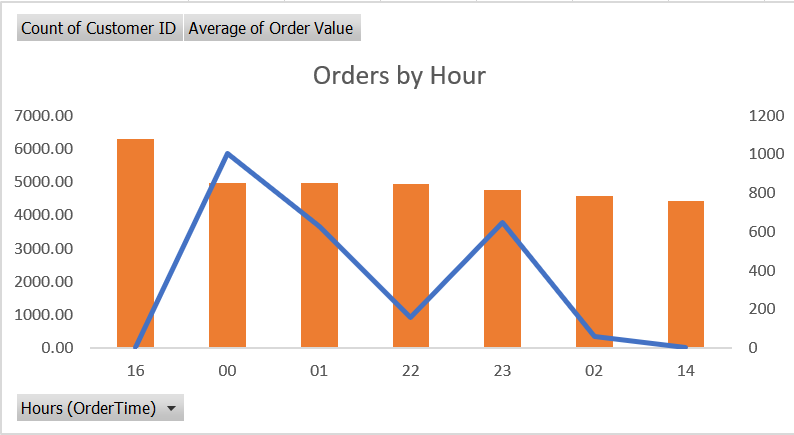
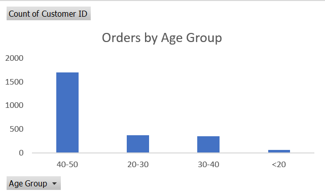
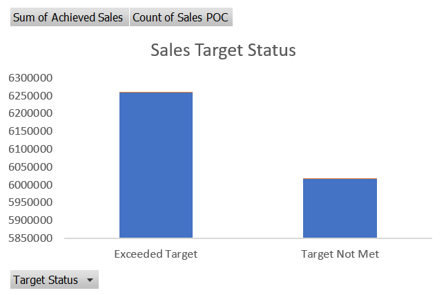

Amazon Orders Data Analysis (Excel Project)
Project Overview

This project analyzes an Amazon Orders dataset using Microsoft Excel.

The objective of this project was to clean the dataset, perform exploratory data analysis, and generate meaningful business insights using Pivot Tables, Excel formulas, and visualizations.

The analysis focuses on:

• Order trends
• Customer demographics
• Sales performance
• Sales target achievement

Tools Used

• Microsoft Excel
• Pivot Tables
• Excel Formulas (IF, SUMIFS, COUNTIFS, AVERAGEIFS)
• Data Cleaning Techniques
• Data Visualization (Charts)

Dataset Description

The dataset contains information related to customer orders and sales performance.

Main columns included in the dataset:

• Customer ID
• Customer Country
• Order Datetime
• Order Source
• Sales POC (Sales Representative)
• Order Value
• Customer Age
• Sales Target

Data Cleaning & Preparation

Before analysis, several preprocessing steps were performed:

• Split Order Datetime into Order Date and Order Time

• Created Order Month and Order Day columns

• Handled missing Age values using moving average

• Detected outliers using the IQR (Interquartile Range) method

• Created Age Groups for demographic analysis

Analysis Performed
1. Orders Trend

A pivot table was created to analyze the number of orders and average order value by month.

This helps identify seasonal patterns and order trends.

2. Orders by Country

Orders were grouped by customer country to identify which countries generate the highest number of orders and sales.

3. Orders by Hour

Order time was analyzed to determine peak ordering hours during the day.

Orders were grouped by hour using pivot table time grouping.

4. Age Group Analysis

Customers were segmented into different age groups:

• Below 20
• 20 – 30
• 30 – 40
• 40 – 50

This helps identify which age group contributes most to orders.

5. Sales Target Analysis

Sales representatives were evaluated based on their achieved sales vs annual sales targets.

Each salesperson was categorized as:

• Target Not Met
• Target Met
• Exceeded Target

Key Insights

• Most orders occur during late-night hours.

• Certain countries generate significantly higher order volumes.

• The 30–40 age group contributes a large portion of orders.

• Some sales representatives exceeded their annual targets.

• However, more sales representatives did not meet their targets.

Project Workflow

Data Cleaning

Feature Engineering

Pivot Table Analysis

Data Visualization

Sales Performance Evaluation

Skills Demonstrated

• Data Cleaning in Excel
• Pivot Table Analysis
• Conditional Logic (IF Statements)
• Aggregation with SUMIFS, COUNTIFS, AVERAGEIFS
• Outlier Detection using IQR
• Data Visualization using Excel Charts
